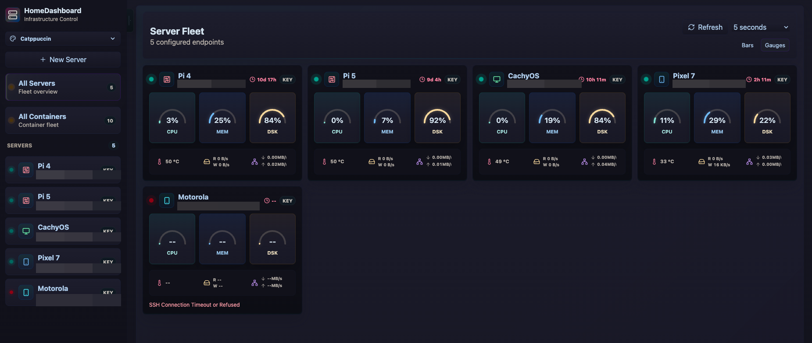
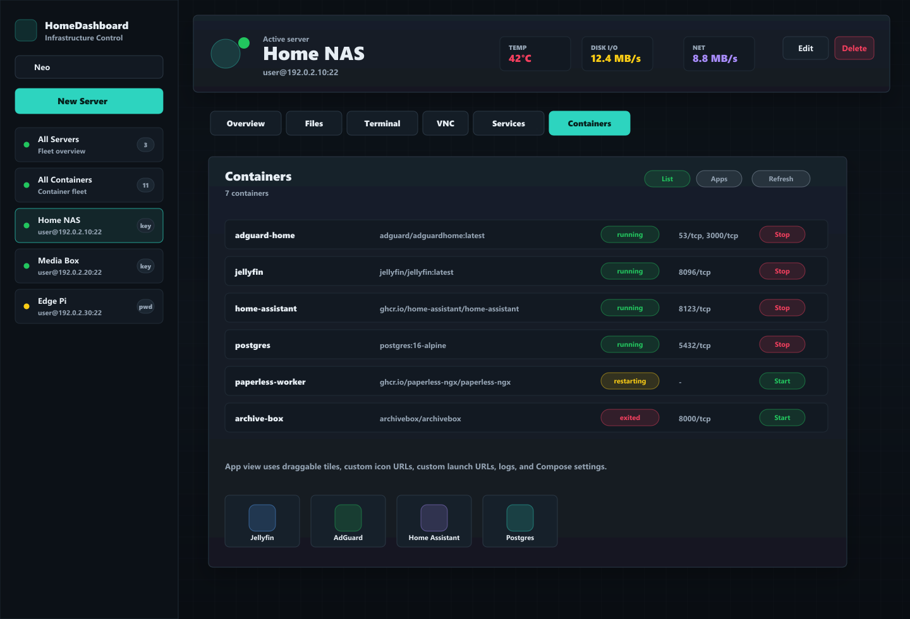
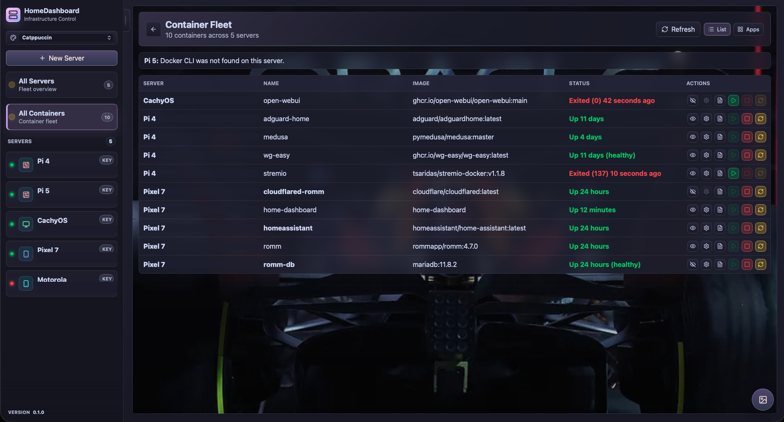
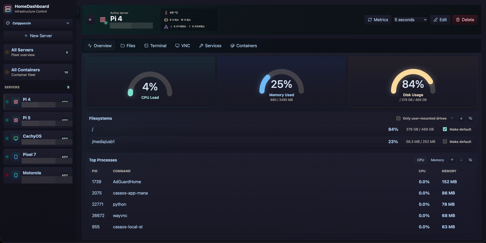
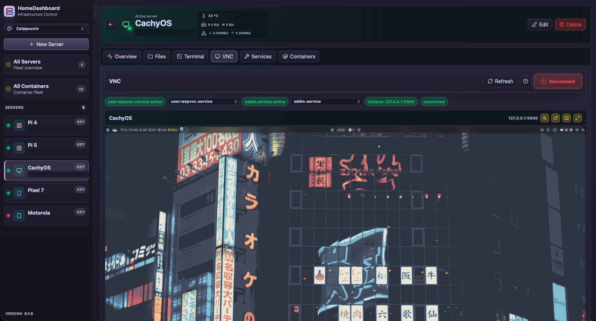

# HomeDashboard

HomeDashboard is a lightweight self-hosted server dashboard for monitoring and managing Linux hosts over SSH. It provides system telemetry, filesystem browsing over SFTP, interactive terminal sessions over WebSockets, and Docker container visibility/control.

## Screenshots



<p>
  
  
</p>

<p>
  
  
</p>

## Quick Start

```bash
git clone https://github.com/demencia89/HomeDashboard.git
cd HomeDashboard
docker compose up --build
```

Open `http://localhost:3000`.

Default login:

- Username: `user`
- Password: `change-me`

The included `docker-compose.yml` is intentionally runnable as-is for a first local test, but those credentials are public defaults. Before using HomeDashboard for real, copy `.env.example` to `.env` and change at least `AUTH_USERNAME`, `AUTH_PASSWORD`, and preferably `ENCRYPTION_KEY`. The default Compose port binding is `127.0.0.1:3000`, so the dashboard is reachable from the host only unless you explicitly change `PORT_BIND_ADDRESS`.

For regular use, set `CONFIG_HOST_DIR` in `.env` to a durable private path outside the repository, such as `/home/your-user/.config/home-dashboard`, so SSH keys and saved server profiles do not live in the source tree.

To stop it:

```bash
docker compose down
```

HomeDashboard manages Linux hosts over SSH, so after logging in, add a server profile with an SSH host, username, and either a password or private key.

## Features

- Fastify + TypeScript backend with a Vite/React frontend.
- SSH-based telemetry collection for CPU, memory, disk, battery, temperature, disk/network I/O, processes, and Docker containers.
- Pooled SSH telemetry with stale-session retry and stdin-delivered collector scripts for hosts that reject very large inline commands.
- Fleet overview with draggable server ordering, Bars/Gauges metric modes, compact battery, temperature, disk I/O, network indicators, theme-aware gauges, and optional shared wallpaper.
- File browsing, upload/download, editing, mkdir, rename, and delete over SFTP.
- Web terminal sessions using `ssh2`, with the terminal surface resizing to the available browser space.
- Docker container list and app-icon views with draggable ordering, logs, custom app icons, guarded start/stop/restart actions, and optional Compose file editing for Compose-managed containers.
- All Servers and All Containers wallpaper support, stored on the server in `/config` so the same wallpaper appears across devices.
- App version display and optional update notifications backed by a configurable release endpoint.
- Temperature sensor and NetHogs network popups from the fleet cards.
- Offline server retry controls that force a fresh SSH metrics collection without returning to high-frequency SSH login churn.
- Multiple visual themes with configurable automatic refresh rate, including a neon-styled Neo theme and a light Minimal theme.
- VNC status, setup, service control, embedded viewer, fullscreen controls, and pop-out viewing.
- Persistent configuration through a mounted `/config` volume.

## Requirements

- Node.js 22+
- Docker and Docker Compose for containerized deployment
- SSH access from the HomeDashboard container to each managed server

## Local Development

```bash
npm ci
npm run dev
```

For the Vite dev server:

```bash
npm run dev:client
```

The Vite server runs on `5173` and proxies API requests to `127.0.0.1:3000`.

## Build

```bash
npm run build
npm start
```

`npm run build` type-checks the backend and frontend, then writes generated output to `dist/`. Do not edit or commit generated build output.

## Docker Compose

The repository includes a working generic Compose file:

```yaml
name: home-dashboard
services:
  home-dashboard:
    image: home-dashboard
    build:
      context: .
    container_name: home-dashboard
    restart: unless-stopped
    environment:
      NODE_ENV: production
      HOST: ${HOST:-0.0.0.0}
      PORT: ${PORT:-3000}
      CONFIG_DIR: ${CONFIG_DIR:-/config}
      LOCAL_FILE_ROOT: ${LOCAL_FILE_ROOT:-/config/files}
      AUTH_DISABLED: ${AUTH_DISABLED:-false}
      AUTH_USERNAME: ${AUTH_USERNAME:-user}
      AUTH_PASSWORD: ${AUTH_PASSWORD:-change-me}
      ENCRYPTION_KEY: ${ENCRYPTION_KEY:-}
      APP_VERSION: ${APP_VERSION:-}
      APP_REVISION: ${APP_REVISION:-}
      APP_BUILD_DATE: ${APP_BUILD_DATE:-}
      APP_UPDATE_CHECK_DISABLED: ${APP_UPDATE_CHECK_DISABLED:-false}
      APP_UPDATE_CHECK_URL: ${APP_UPDATE_CHECK_URL:-https://api.github.com/repos/demencia89/HomeDashboard/releases/latest}
      APP_UPDATE_URL: ${APP_UPDATE_URL:-https://github.com/demencia89/HomeDashboard/releases/latest}
      APP_UPDATE_CHECK_INTERVAL_MS: ${APP_UPDATE_CHECK_INTERVAL_MS:-21600000}
    ports:
      - "${PORT_BIND_ADDRESS:-127.0.0.1}:${PORT:-3000}:${PORT:-3000}"
    volumes:
      - ${CONFIG_HOST_DIR:-./config}:/config
```

Run it directly for a local trial:

```bash
docker compose up --build
```

Open `http://localhost:3000`.

The Compose project, service, container, and built image are all named `home-dashboard`, which is also the CasaOS app id used by the bundled Compose metadata.

Recommended edits before regular use:

- Set a real `AUTH_USERNAME` and a long random `AUTH_PASSWORD`.
- Set a long random `ENCRYPTION_KEY` and keep it with encrypted backups.
- Keep `PORT_BIND_ADDRESS=127.0.0.1` for local/VPN/reverse-proxy access, or bind to a specific LAN IP with firewall rules.
- Set `CONFIG_HOST_DIR` to durable private storage that is backed up securely and not synced to untrusted cloud storage.
- Prefer dedicated SSH keys for managed servers instead of reusing a personal login key.

By default Compose publishes the dashboard on localhost only:

```env
PORT_BIND_ADDRESS=127.0.0.1
```

For VPN-only access, keep the localhost binding and put a local reverse proxy, Tailscale Serve/Funnel replacement, or WireGuard-facing proxy in front of it. For LAN-only access, set `PORT_BIND_ADDRESS` to the server's LAN IP and firewall the port to trusted subnets. Avoid `PORT_BIND_ADDRESS=0.0.0.0` unless host firewall rules already restrict who can connect.

## Configuration

Runtime configuration is provided by environment variables:

- `AUTH_USERNAME` and `AUTH_PASSWORD`: HTTP basic-auth credentials.
- `AUTH_DISABLED`: set to `true` only for trusted private deployments.
- `CONFIG_HOST_DIR`: Docker Compose host path mounted into the container as `/config`; defaults to `./config`.
- `CONFIG_DIR`: persistent configuration directory, defaults to `/config`.
- `LOCAL_FILE_ROOT`: root for local file operations, defaults to `/config/files`.
- `ENCRYPTION_KEY`: optional master secret for stored server passwords. If omitted, HomeDashboard creates `/config/.secret_key`.
- `HOST`, `PORT`, `PORT_BIND_ADDRESS`, `CORS_ORIGIN`: server binding, Docker published-port binding, and CORS settings.
- `APP_VERSION`, `APP_REVISION`, `APP_BUILD_DATE`: optional build metadata shown in the UI. If `APP_VERSION` is unset, HomeDashboard uses the package version.
- `APP_UPDATE_CHECK_DISABLED`: set to `true` to disable the outbound update check.
- `APP_UPDATE_CHECK_URL`: JSON endpoint used to discover the latest version. It may return GitHub release JSON (`tag_name`, `html_url`) or generic JSON (`version`, `releaseUrl`).
- `APP_UPDATE_URL`: URL opened by the Release notes button when a newer version is available.
- `APP_UPDATE_CHECK_INTERVAL_MS`: server-side update check cache interval, defaults to `21600000` ms.
- `AUTH_FAILURE_RATE_LIMIT_MAX`, `AUTH_FAILURE_RATE_LIMIT_WINDOW_MS`: failed Basic auth attempts per client before `429`, defaults to `20` per `300000` ms.
- `EXPENSIVE_HTTP_RATE_LIMIT_MAX`, `EXPENSIVE_HTTP_RATE_LIMIT_WINDOW_MS`: SSH-backed HTTP API requests per client, defaults to `180` per `60000` ms.
- `WS_CONNECTION_RATE_LIMIT_MAX`, `WS_CONNECTION_RATE_LIMIT_WINDOW_MS`: WebSocket connection attempts per client, defaults to `60` per `60000` ms.
- `WS_MAX_CONNECTIONS_PER_IP`: concurrent WebSocket connections per client, defaults to `12`.
- `WS_MESSAGE_RATE_LIMIT_MAX`, `WS_MESSAGE_RATE_LIMIT_WINDOW_MS`: client WebSocket messages per socket, defaults to `2400` per `60000` ms.
- `VNC_ALLOWED_PORTS`: comma-separated VNC bridge ports or ranges, defaults to `5900-5999`.
- `VNC_ALLOWED_HOSTS`: optional comma-separated extra hosts the VNC bridge may connect to. By default the bridge only allows loopback, the selected server profile host, and hosts discovered by VNC status for that server.

Set a limit `*_MAX` value to `0` to disable that specific limiter. The defaults are intended for a trusted LAN dashboard: they should allow normal use while slowing repeated authentication failures, expensive SSH-backed polling, and runaway WebSocket clients.

Persistent data lives in `/config/servers.json`, `/config/keys/`, `/config/.secret_key`, and `/config/wallpaper.json`. Server profiles, keys, and secrets may contain private keys or encrypted credentials and must not be committed. The wallpaper file stores the uploaded shared wallpaper image data. The container entrypoint tightens `/config` directories to `0700` and files to `0600` when it starts as root, but app-readable secrets are still reachable if the container itself is compromised.

## Server Profiles

Each server profile stores the SSH target, authentication method, optional icon, and optional icon color. Icon choices are cosmetic and can be left on Auto; HomeDashboard will infer common device types such as boards, phones, desktops, routers, storage hosts, and cloud instances from the profile name.

HomeDashboard reads common Linux temperature sources automatically, including `hwmon`, thermal zones, power supply temperatures, and Raspberry Pi `vcgencmd` when available.

## Telemetry And Battery

HomeDashboard collects telemetry through SSH using one combined shell collector per refresh. Metrics streams reuse pooled SSH connections to avoid repeated logins, while stale or closed pooled sessions are dropped and retried once on a fresh connection before the server is marked offline. Manual metrics refreshes also clear the pooled connection for that server first.

The collector is sent to remote hosts over SSH stdin with `sh -s`. This keeps the remote command short, which helps embedded or appliance-style SSH servers that reject very large inline command strings.

Battery reporting is generic. HomeDashboard checks Linux power-supply sysfs data, `termux-battery-status` or compatible scripts, Android `cmd battery`/`dumpsys battery`, `upower`, and `acpi`. Devices that expose one of those interfaces can show battery percentage and status in the sidebar server row, fleet card, and selected-server overview. Android or Terminal environments should adapt to one of those generic interfaces rather than requiring a HomeDashboard-specific collector patch.

## Fleet Overview

The fleet overview shows all configured servers as draggable cards. Bars mode uses compact progress cards with subtle animated glints for CPU, memory, and disk usage; Gauges mode uses larger dial-style metric tiles with static filled arcs. The compact indicators below each card show battery level when available, selected temperature, disk I/O, and network throughput.

Temperature and network indicators are interactive. Temperature opens a sensor list where the card reading can be changed per server. Network opens a NetHogs terminal view for the selected host when the required command is available through SSH.

The All Servers and All Containers views can use a shared wallpaper. Use the round image button in the lower-right corner to upload a PNG, JPEG, WebP, or GIF image up to 5 MB. The wallpaper is saved under `/config/wallpaper.json`, rendered with cover sizing to avoid tiling, and shown on every device using that HomeDashboard instance.

When filtering filesystems to "Only user-mounted drives", HomeDashboard still keeps `/`, `/home`, and the selected default filesystem visible when those mounts are present.

## Container Management

The Containers tab supports both a table view and a CasaOS-style app view. Container ordering is stored locally and can be changed by drag and drop in both per-server and all-container views. App tiles can use custom icon URLs and custom launch URLs when Docker port mappings are not enough to infer a link.

Compose-managed containers expose a Settings action when Docker labels include a discoverable Compose file. HomeDashboard reads that Compose file, lets you edit it, validates it with `docker compose config`, writes a timestamped backup, and applies it with `docker compose up -d`. Containers without Compose metadata still support runtime actions and logs, but do not show Compose settings.

The all-container app and list views share the same wallpaper surface as the fleet overview. Cards, tables, headers, and status messages use translucent themed surfaces so wallpaper remains visible without losing readability.

## Terminals And VNC

Terminal sessions run through SSH-backed WebSockets and resize with the active browser viewport while keeping safe minimum dimensions. VNC support discovers common VNC services, exposes setup guidance for supported Linux desktops, tunnels through the selected SSH profile, and uses red disconnect controls to distinguish destructive session-ending actions from normal primary actions.

## Themes And Refresh

The sidebar theme picker changes the app palette across the dashboard, including gauges, status colors, controls, cards, and wallpaper surfaces. Neo uses brighter neon accents and scoped bloom effects; Minimal keeps selected-server and fleet surfaces light. The refresh-rate picker controls automatic telemetry refreshes; set it to Off to rely on manual refresh buttons. When a selected server is offline, the header refresh action changes to Retry and forces a fresh SSH metrics attempt.

## Version And Updates

HomeDashboard displays its current version in the sidebar. By default, the Docker Compose configuration points the update checker at the latest GitHub release for this repository. If a newer release is available, the sidebar shows a bottom-sticky update notice that opens the release notes or can be dismissed. Set `APP_UPDATE_CHECK_DISABLED=true` to disable outbound update checks, or override `APP_UPDATE_CHECK_URL` and `APP_UPDATE_URL` for another release channel.

HomeDashboard does not self-update from inside the app. Updating is an operator action because the app would otherwise need host-level Docker or filesystem control. For source-based installs, update from the host running the project:

```bash
cd /path/to/HomeDashboard
git pull --ff-only
docker compose up -d --build
```

If you build on another machine and copy the image to an ARM64 host, use the same release source and reload the image on the target:

```bash
docker buildx build --platform linux/arm64 --tag home-dashboard:latest --output type=docker,dest=/tmp/home-dashboard-arm64.tar .
scp /tmp/home-dashboard-arm64.tar user@host:/tmp/home-dashboard-arm64.tar
ssh user@host "cd '/path/to/HomeDashboard' && docker load -i '/tmp/home-dashboard-arm64.tar' && rm -f '/tmp/home-dashboard-arm64.tar' && docker compose up -d --no-build --force-recreate home-dashboard"
```

## Security Notes

HomeDashboard can open terminals, browse files, and control containers on configured servers. Run it only on trusted networks, use strong authentication, and keep `/config` private. Prefer dedicated SSH keys with limited access for managed hosts.

Recommended deployment baseline:

- Keep `PORT_BIND_ADDRESS=127.0.0.1` and access the dashboard through VPN or a local reverse proxy.
- If LAN access is needed, bind to the specific LAN address and restrict port `3000` with host firewall rules.
- Never expose the dashboard directly to the public internet.
- Back up `config/` only into encrypted storage.
- Do not sync `config/` through untrusted cloud folders or commit it to Git.
- Set a long random `ENCRYPTION_KEY` and keep it with your encrypted backups; without it, stored SSH passwords cannot be decrypted after migration.

## Repository Hygiene

This repository intentionally ignores `node_modules/`, `dist/`, `.env*`, and `config/`. Use `.env.example` and documentation for shareable configuration, never real credentials or keys.

## License

MIT
